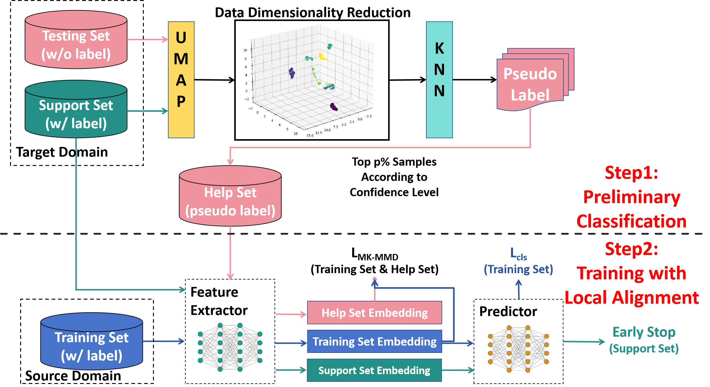
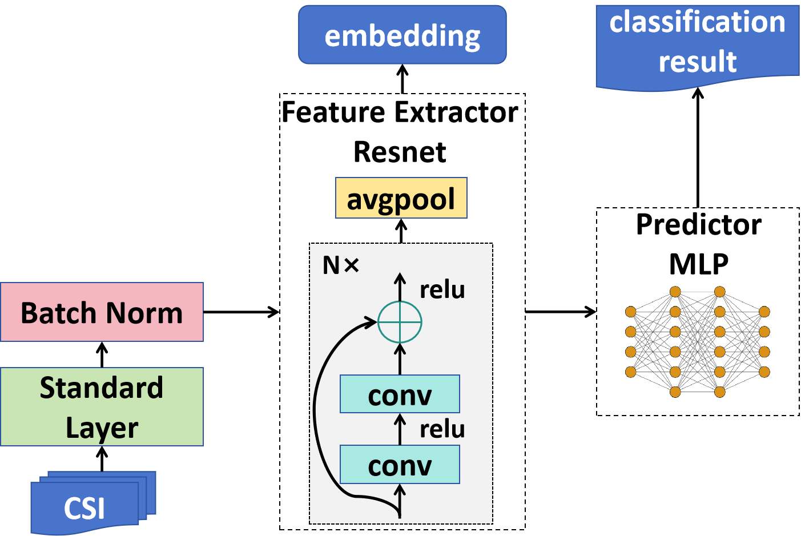

# KNN-MMD

**Article:**

Journal Version: Zijian Zhao, Zhijie Cai, Tingwei Chen, Xiaoyang Li, Hang Li, Qimei Chen, Guangxu Zhu\*, "[KNN-MMD: Cross Domain Wireless Sensing Via Local Distribution Alignment](https://ieeexplore.ieee.org/document/11301623) , IEEE Transactions on Mobile Computing (TMC), 2025

Conference Version: Zijian Zhao, Zhijie Cai, Tingwei Chen, Xiaoyang Li, Hang Li, Qimei Chen, Guangxu Zhu\*, "[Does MMD Really Align? A Cross Domain Wireless Sensing Method via Local Distribution](https://ieeexplore.ieee.org/document/11149311)", IEEE/CIC ICCC 2025

**Patent:** 赵子健, 朱光旭, 陈琪美, 韩凯峰 "基于少样本学习的模型对对象识别的方法及相关设备"（专利号：ZL202411074110，2024）.

**Notice:** We have uploaded our dataset ([RS2002/WiFall · Datasets at Hugging Face](https://huggingface.co/datasets/RS2002/WiFall)) to Hugging Face.




## 1. Data

### 1.1 Dataset

Public Dataset: [WiGesture](https://paperswithcode.com/dataset/wigesture)

Proposed Dataset: WiFall (./WiFall)


### 1.2 Data Preparation

Refer to [RS2002/CSI-BERT: Official Repository for The Paper, Finding the Missing Data: A BERT-inspired Approach Against Package Loss in Wireless Sensing (github.com)](https://github.com/RS2002/CSI-BERT)


## 2. Run the model



To run the model, follow these instructions based on the dataset you are using. For the WiGesture Dataset, use the `train.py` script, and for the WiFall Dataset, use the `train_fall.py` script. The steps to execute them are the same, and here we provide an example using `train.py`.

```
python train.py --k <shot number> --n <neighbor number for KNN> --p <select the top p samples from testing set for MK-MMD (p<1)> --task <action or people> --lr <learning rate>
```

Make sure to replace the following placeholders with the appropriate values:

- `<shot number>`: Specify the shot number.
- `<neighbor number for KNN>`: Specify the number of neighbors for KNN.
- `<select the top p samples from testing set for MK-MMD (p<1)>`: Specify the value for p (selecting the top p samples from the testing set for MK-MMD). Note that p should be less than 1.
- `<action or people>`: Specify the task name as either "action" or "people".
- `<learning rate>`: Specify the desired learning rate.

Once you have set the appropriate values, run the command in your terminal to start the training process.


## 3. Reference

```
@ARTICLE{11301623,
  author={Zhao, Zijian and Cai, Zhijie and Chen, Tingwei and Li, Xiaoyang and Li, Hang and Chen, Qimei and Zhu, Guangxu},
  journal={IEEE Transactions on Mobile Computing}, 
  title={KNN-MMD: Cross Domain Wireless Sensing Via Local Distribution Alignment}, 
  year={2025},
  volume={},
  number={},
  pages={1-18},
  keywords={Channel state information;cross-domain wi-fi sensing;domain alignment;few-shot learning;k-nearest neighbors;maximum mean discrepancy},
  doi={10.1109/TMC.2025.3644902}}

```

```
@INPROCEEDINGS{11149311,
  author={Zhao, Zijian and Cai, Zhijie and Chen, Tingwei and Li, Xiaoyang and Li, Hang and Chen, Qimei and Zhu, Guangxu},
  booktitle={2025 IEEE/CIC International Conference on Communications in China (ICCC)}, 
  title={Does MMD Really Align? A Cross Domain Wireless Sensing Method via Local Distribution}, 
  year={2025},
  volume={},
  number={},
  pages={1-6},
  keywords={Wireless communication;Training;Wireless sensor networks;Codes;Sensitivity;Gesture recognition;Nearest neighbor methods;Stability analysis;Sensors;Wireless fidelity;Few-shot Learning;K-Nearest Neighbors;Maximum Mean Discrepancy;Cross-domain Wireless Sensing;Channel Statement Information},
  doi={10.1109/ICCC65529.2025.11149311}}

```

